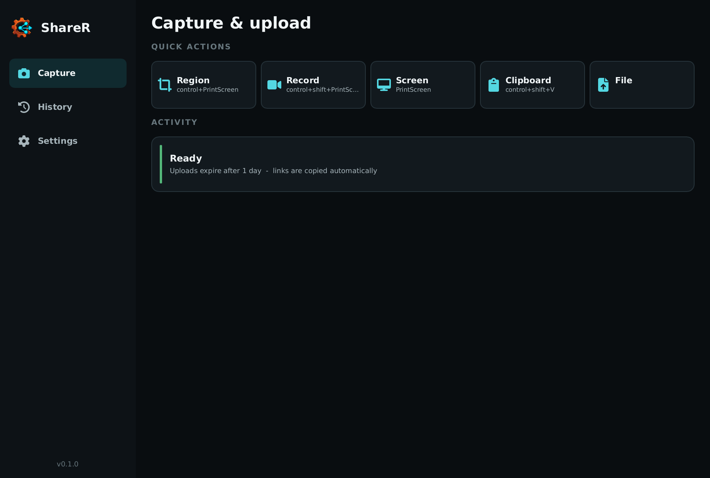
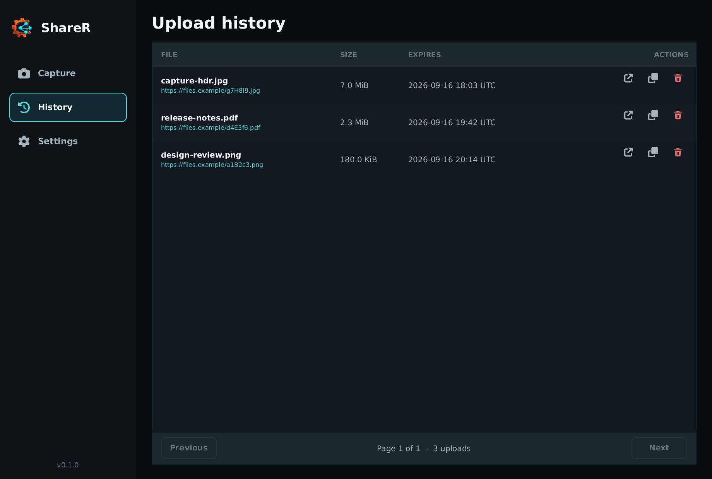
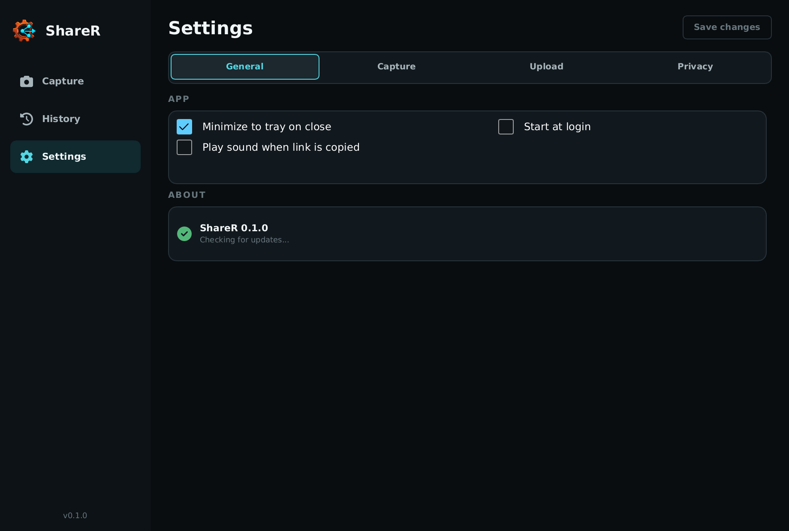
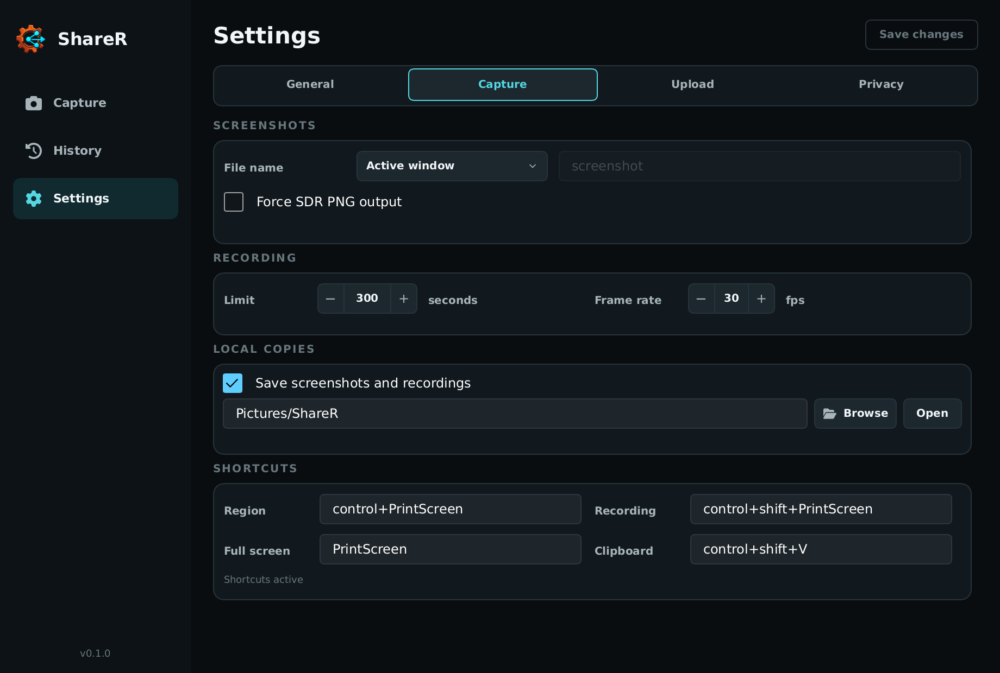
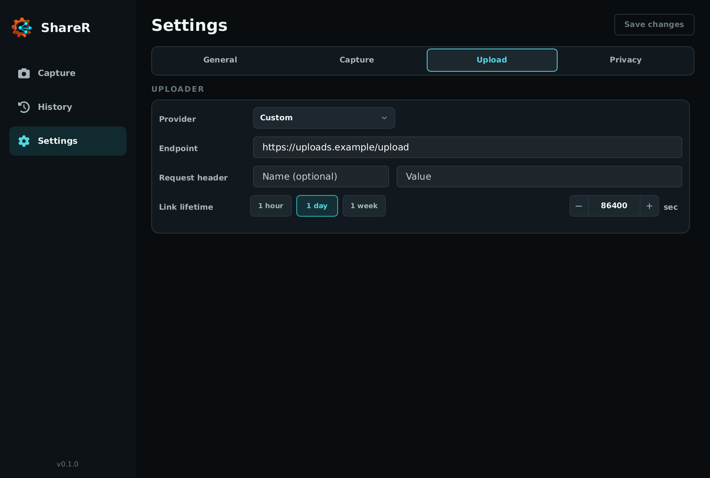
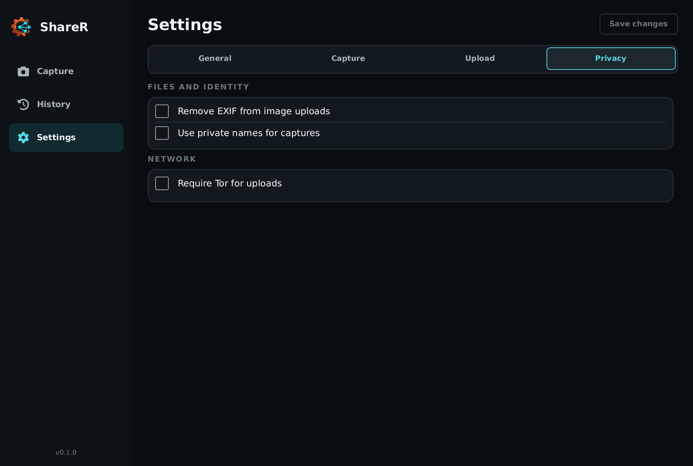

# ShareR

ShareR captures, records, and optionally uploads from one small desktop app. It handles screen regions, full displays, clipboard content, and ordinary files. Use one of the built-in providers or bring your own upload endpoint when you want public links.

## What you can do

**Capture what matters.** Drag an exact region, snap to a window, grab a full display, or record a region directly to animated WebP.

**Share almost anything.** Upload files, clipboard images, clipboard text, and copied files through the same workflow.

**Keep control.** Captures stay local by default. You can opt into automatic uploads, strip EXIF, hide window titles behind random names, and require Tor when a direct upload is not acceptable.

**Stay out of the way.** ShareR lives in the system tray, responds to global shortcuts, and keeps old uploads in a small local history.

## Built to stay small

Low memory use is a core architecture constraint in ShareR. Files stream from disk, upload progress stays bounded, history loads in pages, and closing the window to the tray releases the desktop UI. Region selection prepares displays serially, keeps only bounded previews, and releases them after the click. The selected region is then recaptured at full configured quality, with temporary working buffers released as each processing stage completes. Generated captures and recordings move into the upload pipeline without copying their full buffers.

> “A move from 64K to 640K felt like something that would last a great deal of time. Well, it didn't.”
>
> [Bill Gates, 1989](https://csclub.uwaterloo.ca/resources/tech-talks/1989-bill-gates-talk-on-microsoft/)

## Screenshots

|                       Capture                       |                     History                     |
| :-------------------------------------------------: | :---------------------------------------------: |
|  |  |

|                      General settings                      |                      Capture settings                      |
| :--------------------------------------------------------: | :--------------------------------------------------------: |
|  |  |

|                     Upload settings                      |                      Privacy settings                      |
| :------------------------------------------------------: | :--------------------------------------------------------: |
|  |  |

## Install

Download the archive for your platform from the [latest release](https://github.com/legacy3/sharer/releases/latest):

- `sharer-windows-x86_64.zip`
- `sharer-linux-x86_64.tar.gz`
- `sharer-linux-headless-x86_64.tar.gz`
- `sharer-macos-aarch64.tar.gz`
- `sharer-macos-x86_64.tar.gz`

Release archives include signed build provenance. Verify a downloaded archive with the [GitHub CLI](https://cli.github.com/):

```console
gh attestation verify sharer-windows-x86_64.zip --repo legacy3/sharer
```

### Windows

Extract `ShareR.exe` somewhere permanent and launch it. Add that directory to your user `PATH` if you also want the CLI.

### macOS

Extract the archive and move `ShareR.app` to `/Applications`. Until release builds are signed, remove the download quarantine attribute and launch the app with:

```bash
xattr -dr com.apple.quarantine /Applications/ShareR.app
open /Applications/ShareR.app
```

You can instead try to open ShareR once, then approve it under **System Settings → Privacy & Security**. macOS asks for Screen Recording permission the first time ShareR captures the screen.

ShareR currently requires macOS 14 or newer. The CLI lives inside the app bundle:

```console
/Applications/ShareR.app/Contents/MacOS/ShareR --history
```

### Linux

Extract the archive and install the binary somewhere on `PATH`:

```console
chmod +x ShareR
sudo install ShareR /usr/local/bin/ShareR
```

The desktop archive contains the executable, not Ubuntu's native shared libraries. A normal desktop installation already has many of them. Install any missing runtime packages with:

```bash
sudo apt install libasound2t64 libayatana-appindicator3-1 libgbm1 libgtk-3-0t64 libpipewire-0.3-0t64 libxdo3 libxkbcommon0
```

The headless archive has no graphical dependencies.

## Set it up

Captures work locally without configuring an uploader. To create public links, open **Settings → Upload** and choose a provider, then enable automatic capture uploads under **Settings → Capture**. Imgur needs a client ID, s-ul needs an API key, and vgy.me accepts an optional user key. Uguu and transfer.sh work without credentials.

The Custom provider accepts your own endpoint and one optional request header. The exact request and response format is documented in [Custom uploaders](docs/custom-uploaders.md).

Generated captures are saved locally by default under your Pictures directory in `ShareR/YYYY-MM`. Change the root folder or output behavior under **Settings → Capture**.

## Settings worth knowing

**Privacy.** EXIF removal supports JPEG, PNG, and WebP without recompressing the image. Private names stop window titles from becoming capture filenames. Require Tor blocks uploads when a verified local Tor proxy is not available.

**Retina output.** Macs can keep native pixels or reduce captures to logical size. Fast, Balanced, and Sharp resizing are available, with Fast as the default.

**HDR output.** Windows HDR displays are detected automatically. Force SDR PNG output always creates a standard PNG when compatibility matters more than HDR. Automatic mode keeps HDR output available at every supported capture size. Screenshot processing may temporarily use memory proportional to the source display, selected region, resize filter, and encoded output, then releases those working buffers when capture processing completes.

**History actions.** History records when each new capture was created and defaults to newest first; switch to oldest first from the page header. Right-click an entry, or use its action buttons, to open or copy its local file and path, reveal it in the system file manager, use its remote URLs, or remove it from history.

**Last result.** The Capture page keeps only the latest operation visible. Local results can be opened, revealed, or copied immediately; uploaded results expose their public and deletion links. The idle Ready message stays out of the way.

**Tray click.** A single left click captures a region by default. Change or disable that action under **Settings → General**. Double click opens ShareR, and right click opens the tray menu.

## Default shortcuts

| Action              | Shortcut                    |
| ------------------- | --------------------------- |
| Region capture      | `Control+PrintScreen`       |
| Region recording    | `Control+Shift+PrintScreen` |
| Full-screen capture | `PrintScreen`               |
| Clipboard upload    | `Control+Shift+V`           |

Every shortcut can be changed under **Settings → Capture**.

## CLI

The desktop and headless builds use the same command-line interface:

```console
# Configure an uploader
ShareR --init https://uploads.example/upload
ShareR --init imgur --credential YOUR_CLIENT_ID

# Upload a file for one hour
ShareR document.pdf --time 3600

# Upload clipboard contents
ShareR --clipboard --time 86400

# Require Tor and refuse a direct upload
ShareR document.pdf --require-tor

# Browse history
ShareR --history
ShareR --history --history-limit 5 --json

# Start the desktop app with its CPU-only recovery renderer
ShareR --renderer software
```

The desktop defaults to the platform's preferred renderer. Use `--renderer gpu` to require it or `--renderer software` if the GPU renderer is unavailable or misbehaves. `auto` continues to honor Slint's renderer environment overrides.

Run `ShareR --help` for every option.

## Platform support

| Platform  | Capture                                               | Recording   |
| --------- | ----------------------------------------------------- | ----------- |
| Windows   | Regions, windows, and full displays                   | Regions     |
| macOS 14+ | Regions, windows, and full displays with Retina input | Regions     |
| Linux     | X11 and supported Wayland screenshot portals          | X11 regions |

Global shortcuts require X11 on Linux. Wayland support depends on the compositor's screenshot portal.

## Data and backups

Settings and upload history live in `sharer.sqlite3`:

| Platform | Directory                                        |
| -------- | ------------------------------------------------ |
| Windows  | `%APPDATA%\sharer\config`                        |
| macOS    | `~/Library/Application Support/re.sharer`        |
| Linux    | `$XDG_CONFIG_HOME/sharer`, or `~/.config/sharer` |

Close ShareR before copying the database. It contains settings, capture history, local file paths, and sensitive deletion URLs. Local captures are stored separately under the configured capture directory, which defaults to `Pictures/ShareR`.

## Contributing

Want to fix something or disagree with how it works? Good. Start with [CONTRIBUTING.md](CONTRIBUTING.md).

ShareR is available under the [MIT License](LICENSE).
